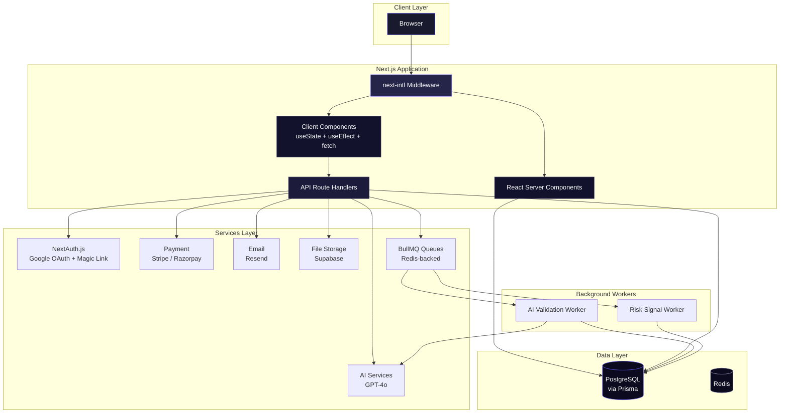

<div align="center">

# TrustFlow AI

**AI-powered accountability platform for freelance project management**

[](https://github.com/your-org/trustflow-ai/actions/workflows/ci.yml)
[](https://www.typescriptlang.org/)
[](https://nextjs.org/)
[](https://react.dev/)
[](https://www.prisma.io/)
[](https://www.postgresql.org/)
[](https://tailwindcss.com/)
[](LICENSE)

</div>

---

## Table of Contents

- [Overview](#overview)
- [Features](#features)
- [Tech Stack](#tech-stack)
- [Architecture](#architecture)
- [Folder Structure](#folder-structure)
- [Getting Started](#getting-started)
  - [Prerequisites](#prerequisites)
  - [Installation](#installation)
  - [Environment Variables](#environment-variables)
  - [Running Locally](#running-locally)
  - [Available Scripts](#available-scripts)
- [Docker](#docker)
- [Deployment](#deployment)
- [API Documentation](#api-documentation)
- [Testing](#testing)
- [CI/CD](#cicd)
- [Security Notes](#security-notes)
- [Known Issues](#known-issues)
- [Roadmap](#roadmap)
- [Contributing](#contributing)
- [License](#license)

---

## Overview

TrustFlow AI is a **modern freelance project management platform** that uses escrow-backed milestone payments, AI-powered contract generation, automated submission validation, and intelligent dispute resolution to bring accountability to freelance collaborations.

**The problem:** Freelance projects suffer from scope creep, late payments, subjective deliverable assessment, and costly disputes. Both clients and freelancers lack a neutral, automated system to enforce agreements fairly.

**The solution:** TrustFlow provides a structured workflow where projects are broken into AI-generated milestones, funds are held in Stripe escrow, deliverables are validated against contract terms (with optional AI review), and disputes are resolved through an AI-assisted process. The platform also includes a public marketplace, team organizations, invoicing, webhook integrations, and API access.

**Target audience:** Freelance clients, independent freelancers, agencies, and enterprises managing external contractors.

---

## Features

### Core Platform

| Feature | Description |
|---|---|
| **AI Contract Generation** | GPT-4o generates milestone-based contracts from a plain-language project description |
| **Escrow Payments** | Stripe payment intents hold funds until milestone approval |
| **Milestone Management** | Sequential work breakdown with status tracking and revision limits |
| **AI Submission Validation** | Automated deliverable review comparing submitted work against agreed scope |
| **AI Dispute Resolution** | Neutral AI suggestion based on contract terms, evidence, and statements |
| **Project Messaging** | Per-project threaded messages |
| **Risk Signals** | Automated risk detection (overdue milestones, inactivity, excessive revisions) |

### Marketplace & Proposals

- Public project listing with search and budget filtering
- Freelancers submit proposals with cover letters and bid amounts
- Clients accept/reject proposals with automatic project assignment

### Team Organizations

- Multi-member organizations with OWNER, ADMIN, MEMBER roles
- Organization-scoped projects
- Email-based member invitations

### Business Features

- **Invoicing**: Create, send, and pay invoices with line items and tax
- **Tax Information**: Multi-jurisdiction tax ID storage (VAT, EIN, GST, etc.)
- **API Keys**: Programmatic access with SHA-256 hashed keys and scoped permissions
- **Webhook Integrations**: GitHub, GitLab, Slack, Linear, and custom webhooks
- **Analytics Dashboard**: Revenue tracking, completion rates, project distribution
- **Audit Log**: Time-series event trail for compliance

### Internationalization

- English (en) and Spanish (es) language support
- Next.js App Router locale-based routing via `next-intl`

---

## Tech Stack

### Frontend

| Technology | Version | Purpose |
|---|---|---|
| [Next.js](https://nextjs.org/) | 16.2 | React framework (App Router, SSR, RSC) |
| [React](https://react.dev/) | 19.2 | UI library |
| [TypeScript](https://www.typescriptlang.org/) | 5.x | Type safety |
| [Tailwind CSS](https://tailwindcss.com/) | 4.x | Utility-first styling |
| [next-intl](https://next-intl-docs.vercel.app/) | 4.13 | Internationalization |

### Backend & Infrastructure

| Technology | Version | Purpose |
|---|---|---|
| [Node.js](https://nodejs.org/) | 20 | Runtime |
| [PostgreSQL](https://www.postgresql.org/) | 16 | Primary database |
| [Redis](https://redis.io/) | 7 | Queue broker (BullMQ) |
| [Prisma](https://www.prisma.io/) | 6.19 | ORM with type-safe client |
| [NextAuth.js](https://next-auth.js.org/) | 5.0-beta | Authentication |
| [Stripe](https://stripe.com/) | 22.3 | Escrow payment processing |
| [Razorpay](https://razorpay.com/) | 2.9 | Alternative payment provider (configured) |
| [OpenAI](https://openai.com/) | 6.49 | AI services (GPT-4o) |
| [Resend](https://resend.com/) | 6.18 | Transactional email |
| [Supabase](https://supabase.com/) | 2.110 | File storage |
| [BullMQ](https://docs.bullmq.io/) | 5.81 | Background job queues |

### Testing & Quality

| Tool | Purpose |
|---|---|
| [Vitest](https://vitest.dev/) | Unit and integration tests |
| [Playwright](https://playwright.dev/) | End-to-end browser tests |
| [ESLint](https://eslint.org/) (9.x) | Code linting |
| [GitHub Actions](https://github.com/features/actions) | CI/CD pipelines |

---

## Architecture



### Request Flow

```
User Action → Browser → next-intl Middleware (locale routing)
                         ├── Server Component → Prisma → PostgreSQL → HTML
                         └── Client Component → fetch(/api/...)
                                                  ↓
                                          API Route Handler
                                                  ↓
                                          getAuthUser() → NextAuth session
                                                  ↓
                                          Business Logic / Service
                                                  ↓
                                          Prisma / OpenAI / Stripe / Resend
                                                  ↓
                                          JSON Response → Client Side Re-render
```

---

## Folder Structure

```
trustflow-ai/
├── .github/workflows/
│   ├── ci.yml                    # Lint, typecheck, build, test
│   └── deploy.yml                # Docker build + migration + deploy
├── e2e/
│   └── example.spec.ts           # Playwright e2e tests
├── messages/
│   ├── en.json                   # English translations
│   └── es.json                   # Spanish translations
├── prisma/
│   ├── migrations/               # Database migrations
│   ├── schema.prisma             # Full schema (24 models, 11 enums)
│   └── seed.ts                   # Seeder (3 users + 6 clause templates)
├── scripts/
│   └── backup.sh                 # pg_dump backup script
├── src/
│   ├── __tests__/
│   │   ├── setup.ts              # Vitest setup
│   │   └── api/                  # API unit tests (escrow, projects, contract)
│   ├── app/
│   │   ├── api/                  # All API route handlers
│   │   │   ├── admin/            # Admin dispute management
│   │   │   ├── ai/               # AI copilot endpoints
│   │   │   ├── analytics/        # Analytics data
│   │   │   ├── api-keys/         # API key CRUD
│   │   │   ├── audit-log/        # Audit trail
│   │   │   ├── auth/             # NextAuth route handler
│   │   │   ├── clause-templates/ # Legal clause templates
│   │   │   ├── contracts/        # AI generate, sign, PDF
│   │   │   ├── disputes/         # Dispute CRUD + resolution
│   │   │   ├── escrow/           # Stripe payment intents
│   │   │   ├── integrations/     # Webhook integrations
│   │   │   ├── invite/           # Project & organization invites
│   │   │   ├── invoices/         # Invoice CRUD + payment
│   │   │   ├── marketplace/      # Public project listings
│   │   │   ├── milestones/       # Submit, approve, reject
│   │   │   ├── notifications/    # In-app notifications
│   │   │   ├── organizations/    # Team orgs + members
│   │   │   ├── profile/          # Freelancer profile
│   │   │   ├── projects/         # Project CRUD + messages + risk
│   │   │   ├── proposals/        # Proposal CRUD + accept/reject
│   │   │   ├── push-subscribe/   # Web push subscriptions
│   │   │   ├── submissions/      # AI review results
│   │   │   ├── tax-info/         # Tax information
│   │   │   ├── upload/           # File upload to Supabase
│   │   │   ├── users/            # User profiles & stats
│   │   │   ├── v1/               # Versioned API (API-key auth)
│   │   │   └── webhooks/         # GitHub & Slack receivers
│   │   ├── admin/disputes/       # Admin disputes page (RSC)
│   │   ├── analytics/            # Analytics dashboard (client)
│   │   ├── auth/signin/          # Sign-in page (client)
│   │   ├── disputes/[id]/        # Dispute detail (client)
│   │   ├── invite/               # Project & org invite pages
│   │   ├── marketplace/          # Public marketplace (client)
│   │   ├── profile/[id]/         # User profile (client)
│   │   ├── projects/
│   │   │   ├── new/              # Create project wizard (client)
│   │   │   └── [id]/             # Project detail (RSC + client)
│   │   │       ├── contract/     # Edit milestones & terms
│   │   │       ├── fund/         # Fund escrow
│   │   │       ├── legal/        # Contract signing + PDF
│   │   │       ├── proposals/    # View/submit proposals
│   │   │       └── submit/[milestoneId]/ # Submit deliverables
│   │   ├── settings/
│   │   │   ├── api-keys/         # API key management
│   │   │   ├── integrations/     # Webhook management
│   │   │   ├── invoices/         # Invoice management
│   │   │   ├── organization/     # Team org management
│   │   │   └── tax/              # Tax info management
│   │   ├── users/[id]/           # Public user profile
│   │   ├── globals.css           # Design tokens + component classes
│   │   ├── layout.tsx            # Root layout (fonts, providers, i18n)
│   │   ├── manifest.ts           # PWA manifest
│   │   └── page.tsx              # Dashboard (RSC, direct Prisma)
│   ├── components/
│   │   ├── language-switcher.tsx # Locale toggle (en/es)
│   │   ├── notification-bell.tsx # Notification dropdown
│   │   └── providers.tsx         # Auth.js SessionProvider
│   ├── i18n/
│   │   ├── request.ts            # next-intl config
│   │   └── routing.ts            # Locale routing
│   ├── lib/
│   │   ├── ai-copilot.ts         # Milestone splitting, deadline prediction
│   │   ├── ai-contract.ts        # AI contract generation
│   │   ├── ai-dispute.ts         # AI dispute resolution
│   │   ├── ai-validator.ts       # AI submission validation
│   │   ├── api-helpers.ts        # Auth helpers (getAuthUser, requireAuth)
│   │   ├── api-key-middleware.ts # SHA-256 API key auth
│   │   ├── auth.ts               # NextAuth configuration
│   │   ├── auth-types.ts         # Session type augmentation
│   │   ├── notifications.ts      # In-app + email notification orchestration
│   │   ├── openai.ts             # OpenAI client singleton
│   │   ├── prisma.ts             # Prisma client singleton
│   │   ├── push-notifications.ts # Web Push API
│   │   ├── queue.ts              # BullMQ queue definitions
│   │   ├── razorpay.ts           # Razorpay client
│   │   ├── resend.ts             # Resend email client
│   │   ├── risk-signals.ts       # Risk computation logic
│   │   ├── stripe.ts             # Stripe client
│   │   └── supabase-storage.ts   # Supabase storage client
│   ├── middleware.ts             # next-intl locale middleware
│   └── workers/
│       ├── ai-validation.ts      # BullMQ AI validation worker
│       └── risk-signal.ts        # BullMQ risk signal worker
├── docker-compose.yml            # Local dev (Postgres + Redis + App)
├── docker-compose.prod.yml       # Production (adds worker + healthchecks)
├── Dockerfile                    # Multi-stage standalone build
├── next.config.ts                # Next.js configuration
├── package.json                  # Dependencies + scripts
├── playwright.config.ts          # E2E test configuration
├── tsconfig.json                 # TypeScript configuration (strict)
└── vitest.config.ts              # Test configuration
```

---

## Getting Started

### Prerequisites

- **Node.js** 20 or later
- **npm** (or pnpm/yarn)
- **PostgreSQL** 16 (local or Docker)
- **Redis** 7 (local or Docker)
- **OpenAI API key** (for AI features)
- **Stripe account** (for escrow payments)
- **Supabase account** (for file storage)
- **Resend API key** (for email)

### Installation

```bash
# Clone the repository
git clone https://github.com/your-org/trustflow-ai.git
cd trustflow-ai

# Install dependencies
npm install

# Set up environment variables
cp .env.example .env
# Edit .env with your credentials

# Generate Prisma client and run migrations
npx prisma generate
npx prisma db push

# Seed the database (optional)
npx prisma db seed
```

### Environment Variables

| Variable | Required | Description |
|---|---|---|
| `DATABASE_URL` | Yes | PostgreSQL connection string |
| `AUTH_SECRET` | Yes | NextAuth.js encryption secret (`openssl rand -base64 32`) |
| `AUTH_GOOGLE_ID` | For Google OAuth | Google OAuth client ID |
| `AUTH_GOOGLE_SECRET` | For Google OAuth | Google OAuth client secret |
| `AUTH_EMAIL_FROM` | For magic links | From address for auth emails |
| `RESEND_API_KEY` | For email | Resend transactional email API key |
| `STRIPE_SECRET_KEY` | For payments | Stripe secret key |
| `NEXT_PUBLIC_STRIPE_KEY` | For payments | Stripe publishable key (client-side) |
| `RAZORPAY_KEY_ID` | Optional | Razorpay key ID |
| `RAZORPAY_KEY_SECRET` | Optional | Razorpay key secret |
| `SUPABASE_URL` | For file uploads | Supabase project URL |
| `SUPABASE_SERVICE_ROLE_KEY` | For file uploads | Supabase service role key |
| `SUPABASE_STORAGE_BUCKET` | For file uploads | Storage bucket name (default: `trustflow-evidence`) |
| `OPENAI_API_KEY` | For AI | OpenAI API key |
| `REDIS_URL` | For queues | Redis connection string |
| `NEXT_PUBLIC_APP_URL` | Yes | Public app URL (default: `http://localhost:3000`) |

### Running Locally

```bash
# Start the development server
npm run dev

# In a separate terminal, start background workers
npx tsx src/workers/ai-validation.ts
npx tsx src/workers/risk-signal.ts
```

The app will be available at [http://localhost:3000](http://localhost:3000).

Using Docker for dependencies:

```bash
# Start PostgreSQL and Redis only
docker compose up -d postgres redis

# Then start the app
npm run dev
```

### Available Scripts

| Script | Command | Description |
|---|---|---|
| `dev` | `next dev` | Start development server |
| `build` | `next build` | Production build |
| `start` | `next start` | Start production server |
| `lint` | `eslint` | Run ESLint |
| `test` | `vitest run` | Run unit tests |
| `test:watch` | `vitest` | Run unit tests in watch mode |
| `test:e2e` | `playwright test` | Run end-to-end tests |

---

## Docker

### Development

```bash
# Start all services (Postgres + Redis + App)
docker compose up -d

# View logs
docker compose logs -f app
```

### Production

```bash
# Build and run production stack
docker compose -f docker-compose.prod.yml up -d --build
```

The production compose file includes:
- PostgreSQL 16 with health checks
- Redis 7 with health checks
- Next.js app (standalone build)
- BullMQ background worker

### Dockerfile

The project uses a multi-stage Docker build:
1. **`deps`** — Install production dependencies
2. **`builder`** — Generate Prisma client + build Next.js standalone output
3. **`runner`** — Minimal production image with standalone server + Prisma

---

## Deployment

The included CI/CD and Docker setup targets self-hosted VPS or container platforms (Railway, Fly.io, Render, etc.).

**Production steps:**

```bash
# 1. Build and push Docker image
docker build -t trustflow-ai:latest .

# 2. Run database migrations
npx prisma migrate deploy

# 3. Deploy image to your platform
# (see .github/workflows/deploy.yml for reference)
```

> **Note:** The deploy workflow in `.github/workflows/deploy.yml` contains a placeholder step. Customize it for your target platform.

---

## API Documentation

### Authentication

Most endpoints require authentication via one of:
- **Browser session** — NextAuth.js cookie (automatic for logged-in users)
- **API Key** — `Authorization: Bearer tf_<key>` header (for programmatic access, v1 endpoints)

### Core Endpoints

<details>
<summary><b>Projects</b></summary>

| Method | Path | Auth | Purpose |
|---|---|---|---|
| `GET` | `/api/projects` | Session | List user's projects |
| `POST` | `/api/projects` | Session | Create project |
| `GET` | `/api/projects/[id]` | Session | Get project detail (includes milestones, contract, risk) |
| `POST` | `/api/projects/[id]/send-invite` | Session (client) | Invite freelancer via email |
| `POST` | `/api/projects/[id]/replace-freelancer` | Session (client) | Replace freelancer |
| `POST` | `/api/projects/[id]/list` | Session (client) | Toggle public marketplace listing |
| `GET` | `/api/projects/[id]/messages` | Session | Get project messages |
| `POST` | `/api/projects/[id]/messages` | Session | Send message |
| `GET` | `/api/projects/[id]/risk-signals` | Session | Get risk signal history |
</details>

<details>
<summary><b>Contracts</b></summary>

| Method | Path | Auth | Purpose |
|---|---|---|---|
| `POST` | `/api/contracts/generate` | Session (client) | AI-generate milestones + terms |
| `POST` | `/api/contracts/[id]/sign` | Session (party) | Sign contract (e-signature) |
| `GET` | `/api/contracts/[id]/pdf` | Session (party) | View contract as HTML |
</details>

<details>
<summary><b>Milestones</b></summary>

| Method | Path | Auth | Purpose |
|---|---|---|---|
| `POST` | `/api/milestones/[id]/submit` | Session (freelancer) | Submit milestone deliverables |
| `POST` | `/api/milestones/[id]/approve` | Session (client) | Approve milestone (releases escrow) |
| `POST` | `/api/milestones/[id]/reject` | Session (client) | Request revision (max 2 revisions) |
</details>

<details>
<summary><b>Escrow / Payments</b></summary>

| Method | Path | Auth | Purpose |
|---|---|---|---|
| `POST` | `/api/escrow/create-intent` | Session (client) | Create Stripe payment intent |
| `POST` | `/api/escrow/confirm` | Session | Confirm escrow funding, start project |
</details>

<details>
<summary><b>Disputes</b></summary>

| Method | Path | Auth | Purpose |
|---|---|---|---|
| `GET` | `/api/disputes` | Session | List user's disputes |
| `POST` | `/api/disputes` | Session (party) | Open dispute on a milestone |
| `POST` | `/api/disputes/[id]/evidence` | Session (party) | Submit evidence/statement |
| `POST` | `/api/disputes/[id]/suggest` | Session (party) | Request AI resolution suggestion |
| `POST` | `/api/disputes/[id]/resolve` | Session (party/admin) | Accept resolution or escalate |
</details>

<details>
<summary><b>Marketplace</b></summary>

| Method | Path | Auth | Purpose |
|---|---|---|---|
| `GET` | `/api/marketplace/projects` | Public | List public projects (?q=&minBudget=&maxBudget=&sort=) |
</details>

<details>
<summary><b>Proposals</b></summary>

| Method | Path | Auth | Purpose |
|---|---|---|---|
| `GET` | `/api/proposals` | Session | List proposals (?projectId=) |
| `POST` | `/api/proposals` | Session (freelancer) | Submit proposal |
| `GET` | `/api/proposals/[id]` | Session (party) | Get proposal detail |
| `PATCH` | `/api/proposals/[id]` | Session | Accept/reject/withdraw |
</details>

<details>
<summary><b>Organizations</b></summary>

| Method | Path | Auth | Purpose |
|---|---|---|---|
| `GET` | `/api/organizations` | Session | List user's orgs |
| `POST` | `/api/organizations` | Session | Create organization |
| `GET` | `/api/organizations/[id]` | Session | Get org detail |
| `PATCH` | `/api/organizations/[id]` | Session (owner) | Update org name |
| `GET` | `/api/organizations/[id]/members` | Session | List members |
| `DELETE` | `/api/organizations/[id]/members` | Session (owner) | Remove member |
| `GET/POST` | `/api/organizations/[id]/invites` | Session (owner) | Manage invites |
</details>

<details>
<summary><b>Invoices</b></summary>

| Method | Path | Auth | Purpose |
|---|---|---|---|
| `GET` | `/api/invoices` | Session | List invoices |
| `POST` | `/api/invoices` | Session | Create invoice |
| `GET` | `/api/invoices/[id]` | Session | Get invoice |
| `PATCH` | `/api/invoices/[id]` | Session | Pay or send invoice |
</details>

<details>
<summary><b>AI Features</b></summary>

| Method | Path | Auth | Purpose |
|---|---|---|---|
| `POST` | `/api/ai/split-milestones` | Session (client) | AI-split project into milestones |
| `POST` | `/api/ai/deadline-predict` | Session | Predict project timeline |
</details>

<details>
<summary><b>v1 API (API Keys)</b></summary>

| Method | Path | Auth | Purpose |
|---|---|---|---|
| `GET` | `/api/v1/projects` | API Key | List client's projects |
| `POST` | `/api/v1/projects` | API Key | Create project |
</details>

<details>
<summary><b>Webhooks</b></summary>

| Method | Path | Auth | Purpose |
|---|---|---|---|
| `POST` | `/api/webhooks/github` | Webhook Signature | Receive GitHub events |
| `POST` | `/api/webhooks/slack` | Public | Receive Slack events |
</details>

### Possible Error Responses

```json
{ "error": "Unauthorized" }           // 401
{ "error": "Forbidden" }              // 403
{ "error": "Not found" }              // 404
{ "error": "Missing email" }          // 400 (validation)
{ "error": "AI suggestion unavailable" } // 503
```

---

## Testing

```bash
# Run unit tests (Vitest)
npm test

# Run tests in watch mode
npm run test:watch

# Run end-to-end tests (Playwright)
npm run test:e2e

# Run Playwright UI mode
npx playwright test --ui
```

**Current test coverage:** Basic unit tests exist for escrow calculation, project validation, and contract generation. E2E tests verify sign-in page loads and redirect behavior. See `src/__tests__/api/` and `e2e/example.spec.ts`.

---

## CI/CD

### Continuous Integration (`ci.yml`)

Triggers on pushes and PRs to `main`:

1. **Lint & TypeCheck**: `npm ci` → `prisma generate` → `npm run lint` → `npm run build`
2. **Test**: Services (PostgreSQL + Redis) → `npm ci` → `prisma generate` → `prisma db push` → `vitest run`

### Deployment (`deploy.yml`)

Triggers on pushes to `main`:

1. Build Docker image
2. Run database migrations
3. Deploy (placeholder — customize for your platform)

---

## Security Notes

### Authentication & Sessions
- NextAuth.js with Prisma adapter (database sessions)
- OAuth (Google) + Magic Link (Resend) — no password-based authentication
- Session user IDs injected via callback — always use `user.id` not `user.email` for authorization

### Authorization
- Inline checks throughout route handlers — no centralized RBAC middleware
- Role check: `user.roles.includes("ADMIN")` for admin endpoints
- Ownership check: `project.clientId === user.id` for client-scoped operations

### API Keys
- SHA-256 hashed before storage (`crypto.subtle.digest`)
- Prefix format: `tf_` followed by 48-character nanoid
- Optional expiry and last-used tracking

### Database
- All foreign keys use `ON DELETE RESTRICT` — no accidental cascade deletes
- Prisma parameterized queries prevent SQL injection
- No raw SQL in application code (safe raw SQL only in analytics)

### Input Validation
- **No schema validation library** (Zod, Yup, etc.) — all validation is manual
- Request bodies parsed as JSON and accessed directly — risk of type errors
- File uploads validated by file presence only

### Known Gaps
- No rate limiting on API endpoints
- No CSRF protection beyond Next.js defaults
- Web Push notifications lack VAPID key configuration
- Push notification implementation uses raw `fetch` instead of Web Push protocol
- No request body size limits

---

## Known Issues

1. **Worker entry point missing** — `src/workers/index.ts` does not exist, but `docker-compose.prod.yml` references `node dist/workers/index.js`. Workers must be started individually.
2. **Web Push notifications incomplete** — `sendPushNotification()` in `src/lib/push-notifications.ts` uses raw `fetch` without proper Web Push encryption (VAPID keys). Push subscriptions are stored but notifications will not be delivered correctly.
3. **No API route for updating projects** — The contract editor page calls `PUT /api/projects/[id]`, but no such route handler exists.
4. **Documentation files are empty** — All files under `docs/` are zero-byte placeholders.
5. **Razorpay configured but unused** — `src/lib/razorpay.ts` initializes the client, but no routes use Razorpay for payments.
6. **Limited test coverage** — Only 7 trivial unit tests exist across 3 test files. No integration tests for API routes.
7. **No contract PDF queue worker** — `contractPdfQueue` is created in `src/lib/queue.ts` but has no associated worker.
8. **Any type casts** — Widespread use of `as any` for JSON fields and request bodies, bypassing TypeScript safety.

---

## Roadmap

Inferred from codebase analysis:

- **Worker bootstrap** — Create `src/workers/index.ts` to start all BullMQ workers
- **Contract PDF generation** — Implement the `contract-pdf` BullMQ worker
- **Stripe Connect** — Freelancer payout via Stripe Connect (model has `stripeConnectAccountId`)
- **Razorpay integration** — Wire up Razorpay as alternative escrow provider
- **Rate limiting** — Add rate limiting to API routes
- **Push notifications** — Fix VAPID key configuration for Web Push
- **Full i18n coverage** — All UI strings use translation keys from `messages/*.json`
- **Test expansion** — Comprehensive API integration tests + more e2e tests
- **OpenAPI/Swagger** — API documentation
- **Server Actions** — Migrate client-side `fetch` calls to React Server Actions

---

## Contributing

1. Fork the repository
2. Create a feature branch: `git checkout -b feat/my-feature`
3. Make your changes
4. Run the linter: `npm run lint`
5. Run tests: `npm test`
6. Commit with conventional commit messages
7. Push and open a Pull Request

### Coding Conventions

- **TypeScript**: Strict mode enabled — avoid `any` casts where possible
- **API Routes**: Always use `getAuthUser()` + `requireAuth()` pattern
- **Prisma**: Use `include` or `select` to limit data — avoid over-fetching
- **Components**: Prefer Server Components (RSC) for data-fetching, Client Components for interactivity
- **CSS**: Use Tailwind utilities + custom design tokens from `globals.css`
- **Internationalization**: String literals belong in `messages/{locale}.json`

---

## License

This project is licensed under the MIT License — see the [LICENSE](LICENSE) file for details.

---

## Acknowledgements

- [Next.js](https://nextjs.org/) — React framework
- [Prisma](https://www.prisma.io/) — Database ORM
- [Auth.js / NextAuth.js](https://authjs.dev/) — Authentication
- [Stripe](https://stripe.com/) — Payment processing
- [OpenAI](https://openai.com/) — AI services
- [Tailwind CSS](https://tailwindcss.com/) — Styling
- [BullMQ](https://docs.bullmq.io/) — Background job queues
- [Supabase](https://supabase.com/) — File storage
- [Resend](https://resend.com/) — Email delivery

---

## Information Needed

The following information could not be automatically inferred from the repository:

- **Repository URL** — Not configured in `package.json`, git remote, or CI
- **Live Demo URL** — No deployment URL configured
- **Maintainer Contact** — Not specified in package.json or security policy
- **Project Logo / Icon** — Referenced in manifest.ts (`/icon-192.png`, `/icon-512.png`) but not present in `public/`
- **License File** — Referenced in this document but not present in the repository
